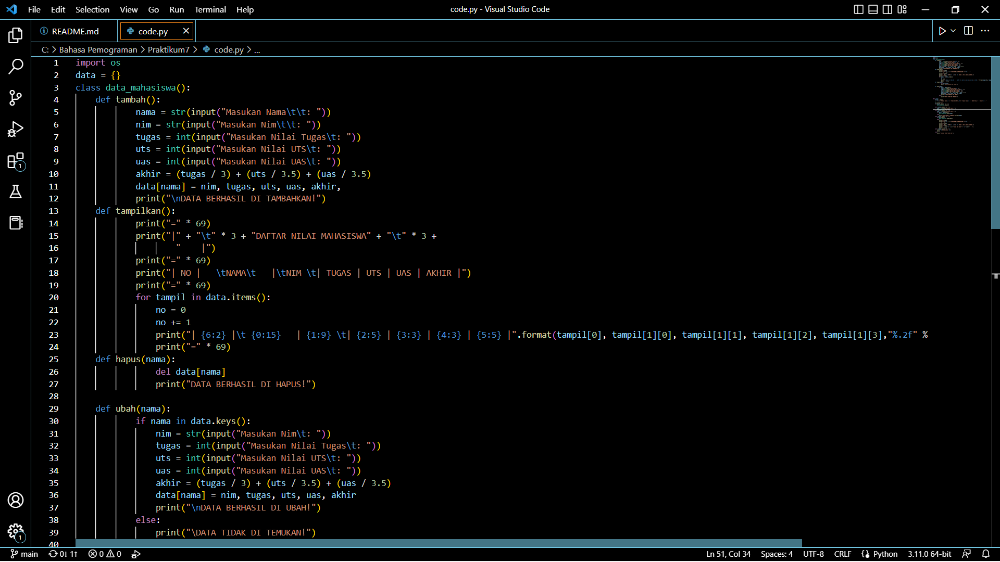
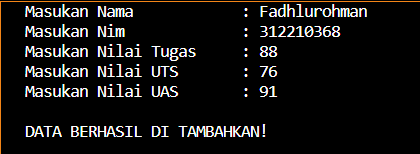
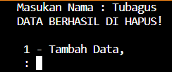

# Praktikum7

# OOP (Object-Oriented Programming)

Program kita kali ini akan menggunakan sistem OOP(Object-Oriented Programming), apa itu OOP? OOP(Object-Oriented Programming) merupakan sebuah cara untuk membangun sebuah aplikasi dengan memandang sebagai presentasi objek-objek yang saling mendukung serta berinteraksi dari satu objek ke objek yang lainnya, dan dapat dikatakan code program akan terbentuk berkelompok berdasarkan objek. Fungsi secara singkat yakni meringkas sebuah program yang berulang-ulang dengan menggunakan syntaks def nama_fungsi(argument). def diartikan sebagai definisi.

1. Kita akan mendeklarasikan atau menginput sebuah variabel bertipe data dictionary kosong data={} yang nantinya akan kita inputkan sebuah data yang terdiri dari: nama, nim, nilai_tugas, nilai_uts, nilai_uas dan nilai_akhir.
2. kita membuat class data_mahasiswa()
3. Membuat fungsi

- Fungsi tambah(), untuk menambahkan data def tambah()
- Fungsi tampilkan(), untuk menampilkan data def tampilkan()
- Fungsi hapus(nama), untuk menghapus nama pada data def hapus(nama)
- Fungsi ubah(nama), untuk mengubah nama pada data def ubah(nama)
- Fungsi salah(), untuk inputan yang tidak sesuai perintah def salah()

4. Menggunakan Perulangan while (while loop) while True:, dapat diartikan perulangan akan terus mengulang jika inputan benar dan masuk kedalam proses jika tidak maka perulangan berhenti atau lanjut ke proses selanjutnya. variabel lanjut kita gunakan untuk menginput perintah yang akan kita proses lanjut=input(str('(L)ihat, (T)ambah, (U)bah, (H)apus, (K)eluar)), disini kita menggunakan statement if untuk memproses perintah yang di inginkan sesuai inputan pada variabel lanjut:

- if (lanjut.lower() == '1'): data_mahasiswa.tambah()

elif (lanjut.lower() == '4'): nama = str(input("Masukan Nama : ")) data_mahasiswa.ubah(nama) elif (lanjut.lower() == '3'): nama = str(input("Masukan Nama : "))

-   if nama in data.keys():
      data_mahasiswa.hapus(nama)
  else:
      print("DATA TIDAK DI TEMUKAN ".format(nama))
      
elif (lanjut.lower() == '2'):

-   if data.items():
      data_mahasiswa.tampilkan()
  else:
      print("=" * 69)
      print("|" + "\t" * 3 + "DAFTAR NILAI MAHASISWA" + "\t" * 3 +
          "    |")
      print("=" * 69)
      print("| NO |   \tNAMA\t   |\tNIM \t| TUGAS | UTS | UAS | AKHIR |")
      print("=" * 69)
      print("|    " + "\t" * 3 + "TIDAK ADA DATA!" + "\t" * 4 + "    |")
      print("=" * 69)

elif (lanjut.lower() == '5'): print("\nTERIMA KASIH! \n") exit() else: print("PILIHAN MENU TIDAK ADA!")

# KODE PROGRAM

# HASIL PROGRAM

- Input Tambah

- Input Tampilkan

- Input Hapus

- Input Ubah

- Input Keluar

- Macam Macam Inputannya

